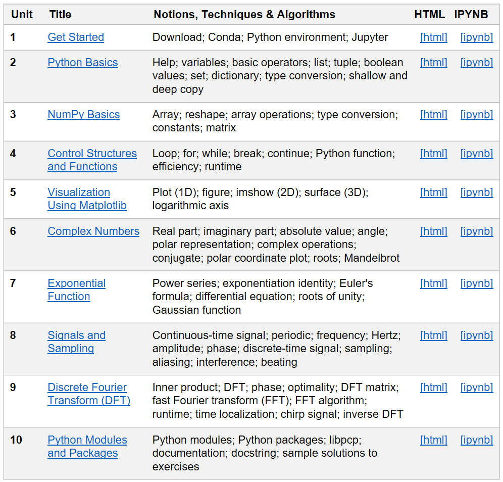

# Summary
Due to the rapid developments in machine learning and the growing importance of open-source software, Python has become the predominant computer programming language for research and education in many scientific fields. While many engineering students on the Master's level have programming skills in different programming languages such as MATLAB, C/C++, or Java, they are often less experienced in using Python and the many associated software frameworks.
The PCP notebooks contribute to closing this gap by offering open-source educational material for a Preparation Course for Python (PCP) while using signal processing as a motivating and tangible application for practicing the programming concepts.
Building upon the open-access Jupyter notebook framework [@KluyverEtAl16_Jupyter_Elpub], the PCP notebooks consist of interactive documents that contain executable code, textbook-like explanations, mathematical formulas, plots, images, and sound examples.  
Assuming some general programming experience and basic knowledge in digital signal processing, the PCP notebooks are designed to serve several purposes.
First of all, they introduce basic concepts of Python programming as required when participating in lab courses in a signal processing curriculum or when working with more advanced signal-processing toolboxes.
Furthermore, the notebooks recap central mathematical concepts needed in signal processing, including complex numbers, the exponential function, signals and sampling, and the discrete Fourier transform.
Another goal of the course is to familiarize students with modern tools for software development and reproducible research.
Providing interactive and well-structured material that may be used in a course or for self-study, we hope that the PCP notebooks make a valuable contribution in fostering education and research in multimedia engineering and beyond.

# Structure, Content, and Access
The PCP course is organized in a modular fashion and consists of ten units, each corresponding to an individual notebook.
The table of Figure 1, which is also part of the starting notebook of the PCP course, gives an overview of these units. Roughly speaking, the first half of the PCP notebooks covers general Python concepts while the second half applies these programming concepts in the context of signal processing.  
In the first unit, we provide basic information on how to set up the Python and Jupyter framework, and discuss some tools used throughout the PCP notebooks.
In the subsequent units, we first discuss the basic data types in Python (Unit 2), then cover the Python package `numpy` [@HarrisEtAl_NumPy_Nature] for processing multi-dimensional arrays and matrices (Unit 3), continue with a short introduction to basic control structures and Python functions (Unit 4), and finally cover the Python library `matplotlib` [@Hunter07_Matplotlib_CSE] for data visualization (Unit 5).
The exercises of these first units already prepare the students for the second half, where we recap fundamental mathematical concepts that are required in signal processing. We start with reviewing some properties of complex numbers (Unit 6) and the complex exponential function (Unit 7), then cover topics such as sampling, aliasing, interference, and beating (Unit 8), and finally discuss the discrete Fourier transform (DFT) and its fast implementation based on the famous FFT (Unit 9). In particular, these units serve for deepening the Python skills acquired in the earlier units while signal processing provides a concrete application that help anchor the abstract programming concepts.
We conclude our course with Unit 10, where we give a short introduction to Python packages and Python modules and, at the same time, also explain the structure of the Python package `libpcp` that underlies the PCP notebooks. In this final unit, will also uncover the secret of where one can find the sample solutions for all exercises.

Each unit is organized in a similar fashion. After giving an overview of a unit's structure and learning objectives, the actual content is presented using executable code, textbook-like explanations, mathematical formulas, plots, images, and sound examples. At the end of each unit, one finds short coding exercises. For self-evaluation, the PCP notebooks provide for each exercise a sample solution in the form of a Python function, contained in one of the modules of the Python package `libpcp`. Each such function, which can be easily traced back by its function name, is executed after the respective exercise to produce the results in question.

The PCP notebooks (including the text, code, figures, and sound examples) are licensed under the open-source MIT License. To keep the initial hurdles as low as possible and to account for different user needs, the PCP notebooks can be accessed and executed in different ways.

- First of all, the exported HTML versions of all PCP notebooks can be found at the authors' institutional website [^1]. This static version allows users to access all material including the explanations, figures, and audio examples by just following the HTML links. Furthermore, the website provides a zip-compressed archive containing all source code and data.

- Additionally, the PCP notebooks (without the exported HTML versions) are hosted at GitHub [^2].

-  To execute the Python code cells, one needs to download the notebooks, create an environment, and start a Jupyter server. The necessary steps are explained in detail in the PCP notebook on how to get started (Unit 1). Within a Jupyter session, one can follow the IPYNB links for navigating between the units.

- As an alternative for executing the notebooks, one can also use web-based services such as Google colab [^3] and Binder [^4]. Explanations on how to run the PCP notebooks using these services can be found on the notebooks' GitHub repository.

[^1]: <https://www.audiolabs-erlangen.de/resources/MIR/PCP/PCP.html>
[^2]: <https://github.com/meinardmueller/PCP>
[^3]: <https://colab.research.google.com/>
[^4]: <https://mybinder.org/>

# Educational Considerations
The immediate contribution of the PCP notebooks is to provide basic material on Python programming as required, e.g., for more advanced lab courses in a signal processing curriculum.  The PCP notebooks are not intended to give a comprehensive overview of Python programming, as provided by online sources such as *The Python Tutorial* [^5] or the *Scipy Lecture Notes* [^6]. Instead, restricting to simple data structures and basic functions (while avoiding more complex topics such as object-oriented programming), the PCP notebooks do not want to overwhelm students when using Python for the first time.
In making a compact selection of Python basics that are then deepened and applied in the context of signal processing, the PCP notebooks provide interactive and well-structured material that may be suited for self-study or may serve as course material. For example, the authors use the PCP notebooks as the basis for a one-week intensive preparatory course offered to new students admitted to the international Master's study programme *Communications and Multimedia Engineering* [^7] (CME). In this course, the students can go through the units at different speeds, where tutors are available for individualized support while encouraging teamwork and student interaction.

When designing the PCP notebooks, another motivation was to provide some basics as required for working with more advanced signal-processing toolboxes. In particular, the PCP notebooks are inspired and designed to bridge the gap to the FMP notebooks for teaching and learning fundamentals of music processing (FMP), see [@MuellerZ19_FMP_ISMIR; @Mueller21_FMP_Signals]. Being based on the same Jupyter framework, the FMP notebooks provide a vehicle for students to transition from comprehending music processing concepts as explained in the textbook by [@Mueller21_FMP_SPRINGER] towards applying and exploring these concepts interactively to music examples.
Furthermore, we want to mention the Python package `librosa` by [@McFeeRLEMBN15_librosa_Python], which is a widely used Python library containing standardized and flexible reference implementations of many common methods in audio and music processing. As detailed in the article by [@MuellerMK21_LearningMusicSP_IEEE-SPM], students can gain programming and signal processing skills using interactive frameworks such as the PCP and FMP notebooks. Then, adopting and creating programming scripts from the elements in `librosa` allows students to delve deeper into the implications---in a music-context---of altering and exploring the role of various parameters common in signal processing.

Besides acquiring these skills, another overarching motivation of the PCP notebooks is to familiarize students with modern software frameworks---a central objective that is also shared by other packages such as the FMP notebooks and `librosa`. For example, the Jupyter framework gives students a powerful tool at hand to carry out research-related mini projects and to communicate and present their results to supervisors and fellow students. Jupyter notebooks can also be exported to a static HTML format, making it possible to generate web applications that can be accessed through standard web browsers with no specific technical requirements.
Additionally, the PCP notebooks may motivate students to start using software tools such as `Conda` [^8] for creating and managing Python environments,
Google colab [^9] or Binder [^10] for executing code, or GibHub [^11] for version control and software archiving.
Last but not least, by employing these tools, students are naturally learning about open access and reproducibility, two topics that cut across disciplines [@McFeeKCSBB19_OpenSourcePractices_IEEE-SPM].

[^5]: <https://docs.python.org/3/tutorial/index.html>
[^6]: <https://scipy-lectures.org/>
[^7]: <https://www.cme.studium.fau.de/>
[^8]: <https://docs.conda.io/en/latest/>
[^9]: <https://colab.research.google.com/>
[^10]: <https://mybinder.org/>
[^11]: <https://github.com/>

# Statement of Need
As described in this document, we pursue multiple goals with the PCP notebooks by offering open-source educational material suited for introducing Python in a signal processing context. Complementing existing open-source tutorials on Python programming, the PCP notebooks focus on only few basic Python concepts while applying these concepts when recapitulating fundamentals in signal processing. We see another main value of the PCP notebooks in the way they interleave executable code, textbook-like explanations, concrete examples, and programming exercises within the unifying Jupyter framework. Being well structured and organized in ten compact units, the PCP notebooks can be used in different ways, e.g., in a preparatory course or for self-study. Furthermore, the notebooks prepare students to use more advance Python packages such as `libfmp` [@MuellerZ21_libfmp_JOSS] and `librosa`  [@McFeeRLEMBN15_librosa_Python] for audio and music processing. Finally, the PCP notebooks indirectly guide students to employ open-source tools for software development and reproducible research. In summary, we hope that the PCP notebooks help students to naturally transition from starting to learn about programming and signal processing to beginning independent research following good scientific practices [@MuellerMK21_LearningMusicSP_IEEE-SPM].

# Acknowledgements
The PCP notebooks build on material and insights that have been obtained in close collaboration with different people. We would like to express our gratitude to former and current students, collaborators, and colleagues who have influenced and supported us in creating this course, including
Vlora Arifi-Müller, Michael Krause, Heinrich Löllmann, Peter Meier, and Frank Zalkow.
The International Audio Laboratories Erlangen are a joint institution of the Friedrich-Alexander-Universität Erlangen-Nürnberg (FAU) and Fraunhofer Institute for Integrated Circuits IIS.

# References
